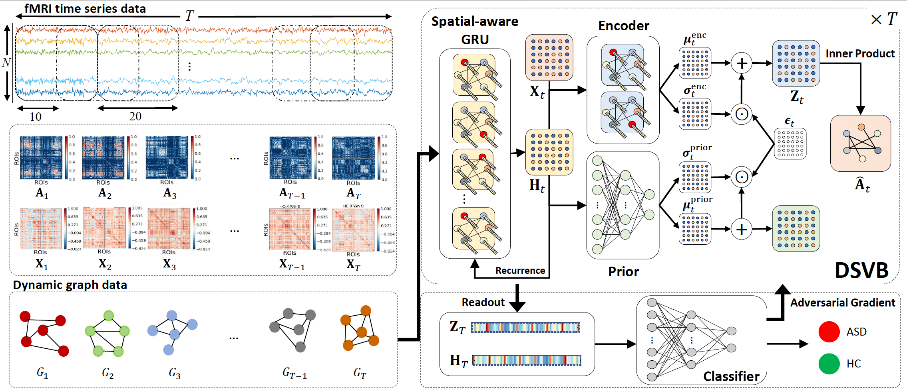

# Deep Spatiotemporal Variational Bayes (DSVB) for Dynamic Graph Representation Learning of Brain Networks

Pytorch implementation of the IJCAI 2024 paper [A Deep Probabilistic Spatiotemporal Framework for Dynamic Graph
Representation Learning with Application to Brain Disorder Identification](https://www.ijcai.org/proceedings/2024/0592).

## Abstract
Recent applications of pattern recognition techniques on brain connectome classification using functional connectivity (FC) are shifting towards acknowledging the non-Euclidean topology and causal dynamics of brain connectivity across time. In this paper, a deep probabilistic spatiotemporal framework developed based on variational Bayes (DSVB) is proposed to learn time-varying topological structures in dynamic brain FC networks for autism spectrum disorder (ASD) identification. The proposed framework incorporates a spatial-aware recurrent neural network with an attention-based message passing scheme to capture rich spatiotemporal patterns across dynamic FC networks. To overcome model overfitting on limited training datasets, an adversarial training strategy is introduced to learn graph embedding models that generalize well to unseen brain networks. Evaluation on the ABIDE resting-state functional magnetic resonance imaging dataset shows that our proposed framework substantially outperforms state-of-the-art methods in identifying ASD. Dynamic FC analyses with DSVB-learned embeddings reveal apparent group differences between ASD and healthy controls in network profiles and switching dynamics of brain states.

## Dependencies
